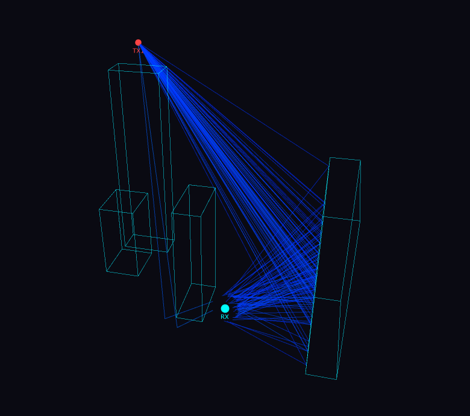

# multipath-passive-radar-sim

GPU-accelerated ray tracing framework for passive radar channel simulation in urban environments.

<p align="center">
  
</p>


The project explores how multipath propagation, urban geometry, and dynamic targets affect passive radar observations. It combines stochastic ray tracing, urban scene generation, and receiver/UAV interaction models into a single simulation pipeline.


---

## Interactive Demo

Explore a precomputed propagation field:

[](https://dealmeidapaulo.github.io/multipath-passive-radar-sim/visualization/static_field_visualization_1a5ae95965.html)

---

## 🚀 Demos (Google Colab)

### Static field simulation & visualization
Run the static field simulation and visualize multipath propagation:

[](https://colab.research.google.com/github/dealmeidapaulo/multipath-passive-radar-sim/blob/main/notebook/static_field_visualization.ipynb)

---

### Scene generation from OpenStreetMap
Create simulation scenes directly from OpenStreetMap data, including buildings and urban geometry reconstruction for ray tracing:

[](https://colab.research.google.com/github/dealmeidapaulo/multipath-passive-radar-sim/blob/main/notebook/osm_scene_generation.ipynb)


---

## Overview

The framework is built around precomputed propagation fields.

A static field is generated by tracing rays from transmitters through an urban scene. Receiver visibility and dynamic targets are evaluated afterward, allowing the same propagation field to be reused across multiple receiver configurations and target scenarios.

Current modeling includes:

- Multipath propagation in urban environments
- Material-dependent reflections
- Fresnel-based angular reflection losses
- Per-obstacle roughness
- Stochastic ray scattering
- Receiver visibility evaluation
- UAV-induced scattering and occlusion
- Doppler shift estimation

---

## Current Capabilities

### Propagation

- GPU-accelerated ray tracing (CUDA)
- Configurable ray emission strategies
- Static field caching and reuse
- Spatial hashing acceleration structures

### Scene Generation

- Procedural urban scene generation
- Obstacle-level material assignment
- Obstacle-level roughness assignment

### Receiver & UAV Modeling

- Receiver evaluation on precomputed fields
- UAV shadowing and scattering
- Doppler computation
- Interactive 3D visualization

---

## Repository Structure

```text
notebook/           Demos
visualization/      Examples
script/             Dataset generation and visualization scripts
src/core/
├── antenna_pattern/    Ray emission distributions
├── gpu/                CUDA kernels and acceleration structures
├── precompute/         Static field generation and caching
├── rx/                 Receiver evaluation
├── scene/              Geometry, materials and propagation models
├── uav/                UAV interaction and scattering
```

---

## Current Status

Current limitations:

- Diffraction modeling (UTD)
- Transmission through obstacles
- Arbitrary mesh ray tracing
- Phase-coherent interference modeling

This project is under active development and both the APIs and propagation models may evolve over time.